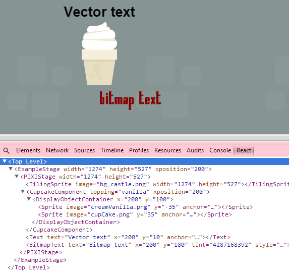

react-pixi
==========

[](https://travis-ci.org/Izzimach/react-pixi)

Create/control a [Pixi.js](https://github.com/GoodBoyDigital/pixi.js) canvas using [React](https://github.com/facebook/react).


## Installation

You will need node and npm. You should probably install gulp globally as well.

```
npm install -g gulp
npm install
```

Simply running

```
gulp
```

Will package up react-pixi along with React and put the result in build/react-pixi.js. If you include this into your webpage via
a script tag:

```
<script src="react-pixi.js"></script>
```

Then "React" will appear in the global namespace and the new React-PIXI components are available under "ReactPIXI"


## Rendering Pixi.js elements

To render Pixi.js elements like a Stage or Sprite you reference them the same way you referenced DOM elements in
vanilla React.  For example, to construct a CupcakeComponent that consists of two Sprites:


```
var CupcakeComponent = React.createClass({
  displayName: 'CupcakeComponent',
  // maps from cupcake toppings to the appropriate sprite
  spritemapping : {
  'vanilla' : 'creamVanilla.png',
  'chocolate' : 'creamChoco.png',
  'mocha' : 'creamMocha.png',
  'pink' : 'creamPink.png',
  },

  render : function () {
    var creamimagename = this.spritemapping[this.props.topping];
    var xposition = this.props.xposition;
    return ReactPIXI.DisplayObjectContainer({x:xposition, y:100 },
      [
        ReactPIXI.Sprite({image:creamimagename, y:-35, anchor: new PIXI.Point(0.5,0.5), key:'topping'}, null),
        ReactPIXI.Sprite({image:'cupCake.png', y:35, anchor: new PIXI.Point(0.5,0.5), key:'cake'}, null)
      ]
    );
  }
});
```



Note that at the moment you need to mount onto a DOM component so your top-level component will probably be a React.PIXI.Stage.

Look in the examples directory for more in-depth examples

## Testing

Testing is done via gulp and karma.

```
gulp test
```

## Caveats

-PIXI filters aren't supported.
-Callbacks are just callbacks. They don't feed into React's event system.
